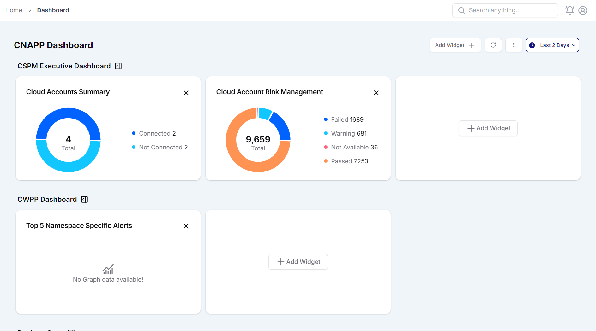

<div align="center">

  <h2 style="font-family: 'Georgia', serif; font-weight: bold; font-size: 2rem; color: #FFE5CA;" align="center">Widget Manager</h2>
</div>

## 📚 Table of Contents

1. 🤖 [Introduction](#-introduction)
1. ✨ [Features](#-features)
1. 🧑‍💻 [Tech Stack](#-tech-stack)
1. 🔧 [Local Setup](#-local-setup)
1. 📄 [Feedback](#-feedback)

## 🤖 Introduction

This web application allows users to dynamically manage widgets within categories. Users can add, update, and remove widgets, as well as search through all available widgets. The application is built with React and uses Zustand for state management.

## ✨ Features

- **📊 Dynamic Widget Management**: Easily add, update, and remove widgets within various categories.
- **📂 Category-Based Organization**: Widgets are grouped by categories for better organization and navigation.
- **🔍 Search Functionality**: Quickly search and filter through all available widgets.
- **➕ Add New Widgets**: User-friendly interface to add new widgets, including name and custom text.
- **❌ Remove Widgets**: Simple and intuitive cross icon to remove widgets from categories.
- **🗃 Manage Categories**: Add or remove widgets directly from the category list.
- **🔄 Real-time State Management**: Efficiently manage application state using Zustand (or another state management tool).
- **🎨 Styled with TailwindCSS**: Sleek, modern, and fully responsive design.
- **🌐 Built with Next.js 14**: Utilizing the latest features of Next.js.
- **🚀 Deployed on Vercel**: Fast and scalable deployment on Vercel.

## 🧑‍💻 Tech Stack

- ⚛️ [React](https://reactjs.org/): UI library for building user interfaces.
- ⬜ [Next.js](https://nextjs.org/): React framework for server-side rendering and static site generation.
- 💨 [Tailwind CSS](https://tailwindcss.com/): Utility-first CSS framework for rapid UI development.
- 💎 [Shadcn UI](https://shadcn.dev/): UI components for React with a focus on accessibility.
- <span style="background-color:#1e90ff;color:white;padding:1px 3px;border-radius:3px;font-size:0.7em;margin-left:3px;">TS</span> [TypeScript](https://www.typescriptlang.org/): Superset of JavaScript adding static types.

- 🛠️ [Zod](https://zod.dev/): Schema validation for TypeScript and JavaScript.
- 🐻 [Zustand](https://zustand-demo.pmnd.rs/): Lightweight state management for React.
- 🚀 [Vercel](https://vercel.com/): Platform for frontend deployment and serverless functions.

## ⚙️ Local setup

1. Clone this repository:
   ```bash
   git clone https://github.com/Vinod-Mane3021/Accuknox-Dashboard-Assignment.git
   ```

2. Go to project folder
   ```bash
   cd Accuknox-Dashboard-Assignment
   ```
3. Install dependencies:

   ```bash
   pnpm install
   ```

4. Start the development server:
   ```bash
   pnpm run dev
   ```

<!--

## 📝 Contributing

If you’d like to contribute to this project, please fork the repository and submit a pull request with your changes. For more details, see the [CONTRIBUTING.md](CONTRIBUTING.md) file.

## 📄 License

This project is licensed under the MIT License. See the [LICENSE](LICENSE) file for details. -->

## \***\*📄 Feedback\*\***

I'd be happy to connect with you! <br>

<a href="https://www.linkedin.com/in/vinod-mane-a74817220/" target="_blank">
  
</a> 
<a href="https://x.com/VinodMane21" target="_blank">
  
</a>
